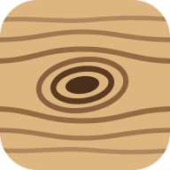
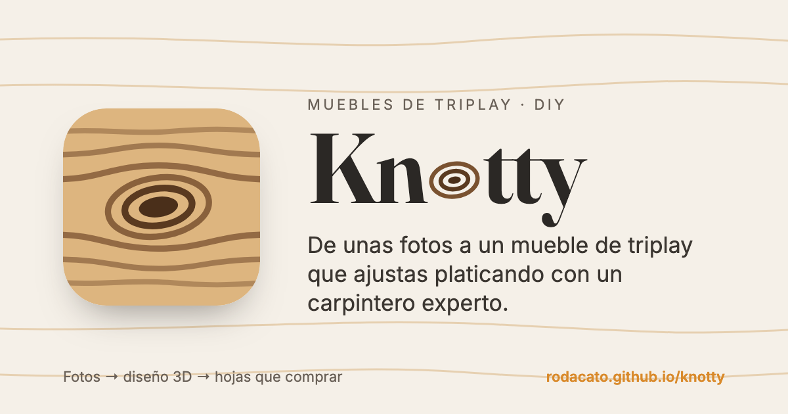

<p align="center"></p>

<h1 align="center">Knotty</h1>

<p align="center"><em>Naughty knots.</em> De unas fotos a un mueble de triplay que ajustas platicando con un carpintero experto (un LLM): diseño 3D, cómo se arma y cuántas hojas comprar.</p>

<p align="center"><a href="https://rodacato.github.io/knotty/"><strong>Abrir la app</strong></a></p>



La propuesta, las decisiones y el estado viven en [docs/PROPUESTA.md](docs/PROPUESTA.md).

## Desarrollo

```bash
npm install
npm run dev        # http://localhost:5173
npm test           # dominio, casos de uso y adapters
npm run typecheck
npm run build      # dist/, listo para GitHub Pages
npm run compare    # el banco contra expertos reales; cuesta tokens, solo a mano
```

Antes de abrir un PR, [CONTRIBUTING.md](CONTRIBUTING.md) dice cómo comprobar que un cambio funciona.

Se puede instalar como app desde el navegador (PWA) y abre sin conexión; el experto sí necesita red.

Sin API key funciona en modo **Simulado**, que entiende unos cuantos pedidos ("hazlo de 90 cm de ancho", "que aguante libros", "baja una repisa 10 cm", "refuerza la base", "agrega un divisor al centro"). Para usar Claude, OpenAI o [SheLLM](https://rodacato.github.io/SheLLM/), abre el engrane en la app y pon tu llave: se queda en el dispositivo, en memoria, en la pestaña o cifrada con una frase.

## Arquitectura

- `src/domain/`: modelo del mueble, operaciones, validación, reglas estructurales. TypeScript puro, en seis grupos: `materials/`, `design/`, `checks/`, `furniture/`, `editing/` y `session/`.
- `src/application/`: casos de uso, construcción del contexto para el LLM y el banco de pruebas.
- `src/ports/`: interfaces hacia afuera.
- `src/adapters/`: Anthropic, OpenAI y SheLLM, el experto simulado, localStorage, catálogo, imágenes y bitácora. Los prompts están en `src/adapters/llm/prompts/`.
- `src/ui/`: React y la escena 3D.
- `public/catalog/catalog.json`: materiales, herrajes y parámetros de acomodo; se edita sin tocar código.

`src/architecture.test.ts` verifica que ninguna capa importe lo que no debe.

## Marca

Los SVG de la marca viven en `scripts/brand/`. Para regenerar el favicon, los íconos de la PWA y la imagen para compartir (`public/share.png`) hace falta `rsvg-convert` (`brew install librsvg`) y Google Chrome:

```bash
./scripts/brand/generate.sh
```
