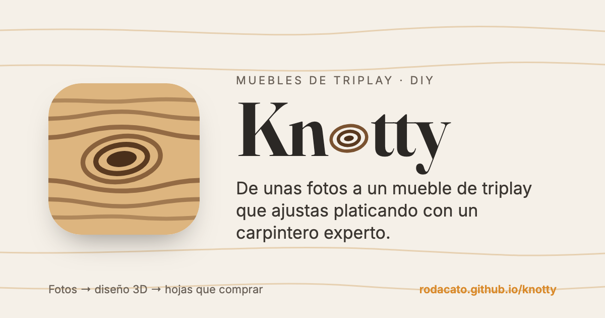

<p align="center"></p>

<h1 align="center">Knotty</h1>

<p align="center"><em>Naughty knots.</em> From a few photos to a piece of plywood furniture you adjust by talking with an expert carpenter (an LLM): 3D design, how it goes together and how many sheets to buy.</p>

<p align="center"><a href="https://rodacato.github.io/knotty/"><strong>Open the app</strong></a></p>



The proposal, the decisions and the state live in [docs/PROPUESTA.md](docs/PROPUESTA.md) (in Spanish). The app itself is in Mexican Spanish.

## Development

```bash
npm install
npm run dev        # http://localhost:5173
npm test           # domain, use cases and adapters
npm run typecheck
npm run build      # dist/, ready for GitHub Pages
npm run compare    # the bench against real experts; costs tokens, by hand only
```

Before opening a PR, [CONTRIBUTING.md](CONTRIBUTING.md) says how to check that a change works, and [docs/workflows.md](docs/workflows.md) what to do and where each thing goes.

It installs as an app from the browser (PWA) and opens offline; the expert does need the network.

Without an API key it works in **Simulado** mode, which understands a few requests ("hazlo de 90 cm de ancho", "que aguante libros", "baja una repisa 10 cm", "refuerza la base", "agrega un divisor al centro"). To use Claude, OpenAI or [SheLLM](https://rodacato.github.io/SheLLM/), open the gear in the app and enter your key: it stays on the device, in memory, in the tab or encrypted with a passphrase.

## Architecture

- `src/domain/`: the furniture model, operations, validation, structural rules. Pure TypeScript, in groups by intent (`materials/`, `design/`, `estimate/`, `checks/`, `editing/`, `furniture/`, `session/`).
- `src/application/`: use cases, building the context for the LLM, and the bench.
- `src/ports/`: interfaces to the outside.
- `src/adapters/`: Anthropic, OpenAI and SheLLM, the simulated expert, localStorage, catalog, images and log. The prompts are in `src/adapters/llm/prompts/`.
- `src/ui/`: React and the 3D scene.
- `public/catalog/catalog.json`: materials, hardware and layout parameters; it is edited without touching code.

`src/architecture.test.ts` checks that no layer imports what it must not.

## Brand

The brand's SVGs live in `scripts/brand/`. Regenerating the favicon, the PWA icons and the share image (`public/share.png`) needs `rsvg-convert` (`brew install librsvg`) and Google Chrome:

```bash
./scripts/brand/generate.sh
```
